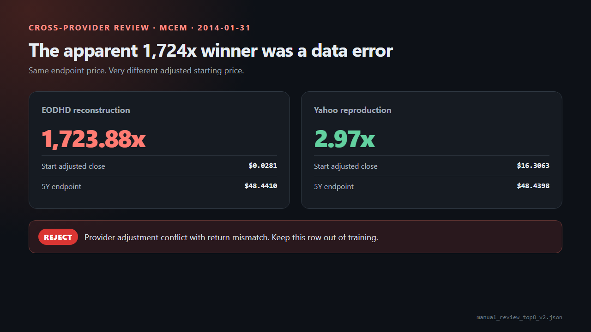
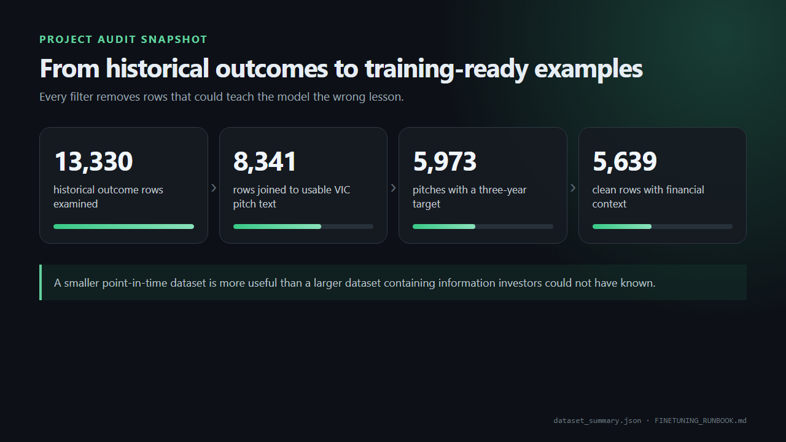
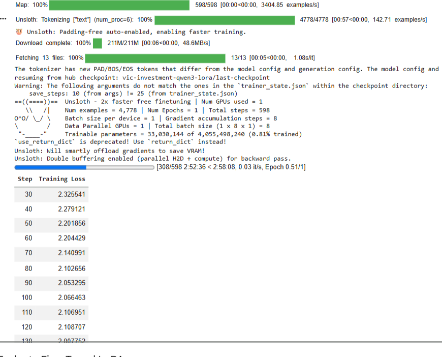
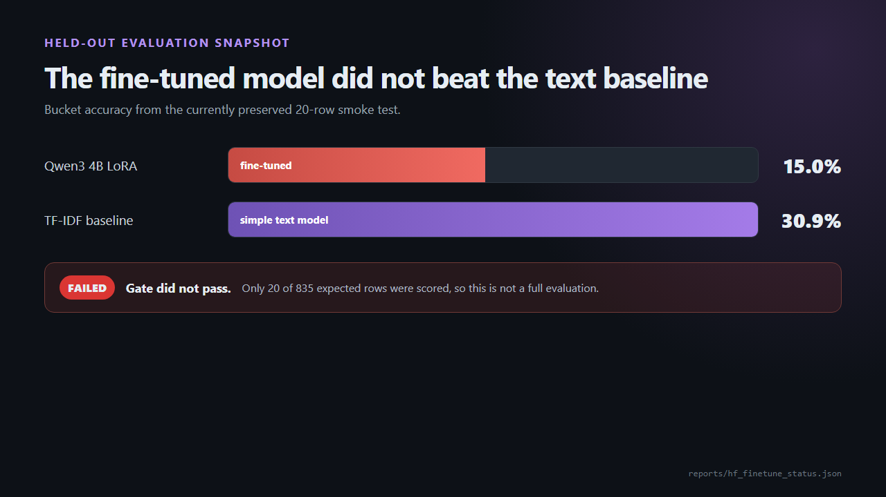

# I tried to teach an AI what a great business looks like

The model failed its first real test. The work leading up to that failure changed how I think about AI in investing.

I started with a question that sounded simple enough: could I train an AI model to recognize the qualities behind a great investment?

I wasn't interested in building another chatbot that summarizes annual reports. General models can already explain a balance sheet, pull out management commentary, and give you a neat list of risks. That can save time, but it isn't investment judgment.

I wanted to try something harder. Could a model read an investment thesis as it existed at the time, study the company's financial position, and learn which patterns tended to show up before a business became a great investment?

That was the idea. In practice, I spent far less time tuning the model than I did fixing dates, tracing dead tickers, checking stock splits, and trying to work out whether a spectacular historical return had really happened.

The more I worked on it, the more the project became a test of my own research process. Before I could ask whether an AI could identify a great business, I had to decide what a valid example of one even looked like.

## Why I started with real investment pitches

I used historical ideas from Value Investors Club as the starting point. VIC pitches contain something most financial datasets don't: an investor explaining why the market is wrong.

The pitches discuss the business, valuation, management, risks, industry structure, and the catalyst that might close the gap. Some are long ideas. Others are shorts. Because the publication dates are known, I can go back and see what information was available when the argument was made, then compare it with what happened later.

That gave me a rough structure for each training example. The model would receive the original thesis, the publication date, the long or short direction, and the financial statements that were public at the time. The label would be the outcome three years later.

Long and short ideas needed to be put on the same scale. If a long doubled, that was a good outcome. If a short fell by half, that was also a good outcome. I inverted the return for shorts so that success pointed in the same direction across the dataset.

What I liked about this setup was that it captured more than a collection of winning stocks. It captured a decision. What did the investor believe? What evidence did they have? What were they missing? And what happened after that?

At least, that was what I thought I had built. Then I started checking the return labels.

## The 1,724x winner that wasn't

I originally assumed historical returns would be the easy part. Find the stock price near the publication date, find it again three years later, adjust for splits, and calculate the change.

Old market data is nowhere near that clean.

Companies change tickers. They merge, spin off divisions, move to OTC markets, get acquired, or go bankrupt. A ticker can later be reused by a completely different company. Sometimes shareholders receive cash or shares in another business. Sometimes the equity simply disappears.

Adjusted prices help, but they aren't magic. They are still a provider's reconstruction of what happened.

The result that forced me to take this seriously was MCEM. My EODHD data appeared to show a five-year return of roughly 1,724x. That would make it one of the most extraordinary winners in the dataset.

It was wrong.

When I reproduced the calculation with Yahoo data, the return was closer to 2.97x. Still a good result, but nowhere near 1,724x. The huge number came from a broken adjusted starting price.

*The same five-year endpoint produced completely different returns because the providers disagreed on the adjusted starting price. The review pipeline rejected the row.*

That one error could have badly distorted the training data. The model might have treated every feature in that pitch as part of the pattern behind a historic winner. It would have been learning confidently from something that never happened.

After that, I stopped treating a return in a CSV as ground truth. It became a claim that needed evidence.

I built a validation process around 13,330 historical outcome rows. EODHD supplied price histories, splits, dividends, fundamentals, and delisted-symbol records. I used Yahoo as a second source for suspicious cases. When the numbers still looked strange, I went back to the actual company history.

This mattered because blindly rejecting every outlier would create a different problem. Celsius, Etsy, Apple, Nvidia, and SBA Communications all produced unusually large five-year returns in the sample I checked. Their returns looked suspicious, but another provider reproduced the moves and the business stories made sense. Those were exactly the kinds of unusual winners I wanted the model to study.

So I couldn't use a simple rule like "everything above 15x is bad." I needed to check whether it was the same security, whether there had been a split or acquisition, whether another source agreed, and whether the growth of the actual business made the result believable.

At one stage, the automatic process marked 6,994 rows as candidates, left 3,841 for manual review, and recorded 2,495 provider errors. Those weren't final training rows. They were the output of a long filtering process that told me which labels might be trusted and which ones still needed work.

This was the point where the project stopped feeling like a model-training exercise. I was building an evidence trail.

## Teaching the model without letting it cheat

Once I had better outcome labels, I wanted to add the company's financial position at the time of each pitch.

This introduced a quieter problem: hindsight.

Imagine that a pitch was published on March 15. The company's annual report covers the year that ended on December 31, but the report wasn't filed until March 30. If I attach that report to the March 15 pitch, the accounting period looks historical, but the information wasn't public yet.

The model gets to peek fifteen days into the future.

That kind of leakage is easy to miss. The dates look close and the financial year is already over. But an investor reading the pitch on March 15 could not have known what was in that filing.

I had to track two different dates: the period a statement covered and the date investors could read it. The strict version of the pipeline produced 5,249 usable rows with pitch text, a three-year outcome, and complete point-in-time financial context. A conservative repair process increased that to 5,639 rows by estimating availability dates when exact filing dates were missing. I used 60 days for quarterly statements and 120 days for annual statements, and I kept those 1,427 estimated rows labeled so I can test them separately.

The numbers got smaller at every stage. I began with 13,330 outcome rows. Of those, 8,341 joined cleanly to usable VIC pitch text. There were 5,973 pitches with a three-year target, and 5,639 survived the repaired financial-context process.

*The dataset shrank as I removed rows with missing pitch text, unusable outcomes, or incomplete point-in-time financial context.*

I don't see that reduction as a disappointment anymore. A smaller dataset that respects time is worth more than a larger one that quietly contains tomorrow's information.

I ran into the same issue with earnings-call transcripts. I collected 9,036 transcript bodies across 843 clean rows, covering calls after the original pitch. Those calls are useful because they show whether management delivered, whether the thesis broke, and which warning signs appeared later.

But I kept the transcript text out of the predictive training input. Asking a model to read calls from two years after a pitch and then "predict" the three-year outcome would produce a lovely demo. It would also be cheating.

The transcripts now sit in the analysis dataset, where they can help explain why an idea succeeded or failed. The model trying to predict the outcome only sees information that was available when the decision was made.

## Watching the model train felt better than seeing the result

For the first run, I used Qwen3 4B with LoRA on a free Google Colab GPU. LoRA updates a small set of adapter parameters instead of retraining the entire model. QLoRA keeps the base model quantized to reduce memory use, which is what made the experiment practical on modest hardware. The approach comes from the [QLoRA research paper](https://papers.neurips.cc/paper_files/paper/2023/file/1feb87871436031bdc0f2beaa62a049b-Paper-Conference.pdf).

*The Qwen3 4B LoRA run in Colab. It processed 4,778 training examples for one epoch and updated about 33 million parameters, around 0.81% of the model.*

I remember looking at this screen and feeling relieved. The job was running. The training loss was coming down. The adapter was saving correctly. After all the work on the data, it finally looked like I had a model.

I had really proved that the training code worked.

The useful test came afterward. I compared the fine-tuned model with deliberately boring alternatives. One baseline ignored the pitch and predicted the median outcome from the training set every time. Another used TF-IDF text features with a conventional statistical model.

The result currently preserved in the project is only a 20-row smoke test, so it is not enough for a final conclusion. Still, the direction was not encouraging. The fine-tuned model achieved 15% bucket accuracy. The TF-IDF baseline was about 30.9%.

*The preserved smoke test failed the evaluation gate. It also covered only 20 of 835 expected rows, so it cannot stand in for a complete held-out evaluation.*

I had to say it to myself in the simplest possible way: the trained model was worse than the boring baseline.

That was humbling, but it was also the most useful result in the project. A falling training loss does not mean a model has learned anything that generalizes. A polished response does not mean the prediction contains signal. Even beating one historical test would deserve skepticism because financial backtests are extremely easy to overfit. The paper on the [probability of backtest overfitting](https://papers.ssrn.com/sol3/Papers.cfm?abstract_id=2326253) goes much deeper into that problem.

I haven't retrained and fully evaluated the newest 5,639-row dataset yet. Until that happens, I can't claim the model identifies great businesses, predicts returns, or adds anything useful to an investment ranking.

The experiment ran, but the investment claim remains unproven.

## What I would actually use AI for now

This project has made me much less interested in saying that AI can pick stocks.

I can see a useful role for it in the research process, though. I want a system that can compare a new thesis with thousands of older ones, apply the same questions every time, and point out where the argument conflicts with the financial statements. I want it to track whether a catalyst happened and notice when later evidence weakens the original case. I want it to find historical analogues without revealing their future outcomes too early.

That would help me look at more companies, but it would also make my own thinking easier to audit. If I become attached to a thesis, the system should show me the evidence I am ignoring, not invent a more persuasive version of my argument.

The human part doesn't disappear. I still have to define what success means, decide which information belongs in the analysis, work through odd corporate actions, and judge whether a statistical improvement would matter in an actual portfolio. The model doesn't bear the cost when an investment goes wrong. I do.

The next version of the experiment will probably ask a narrower question. Predicting an exact three-year return may be too noisy for a small model trained on a few thousand examples. Ranking ideas or separating them into broad outcome groups may be more realistic. I also want to compare the language model with ordinary machine-learning models using the same financial data, then evaluate longs, shorts, and estimated-date rows separately.

Even if return prediction remains weak, other outputs may still be useful. Can the model identify the fragile assumption in a thesis? Can it tell the difference between a temporary earnings problem and deterioration in the business? Can it notice when the expected return depends mostly on the valuation multiple rising?

Those are the questions I care about now.

I started this project hoping to train an AI to identify great businesses. What I built first was a system for checking whether my historical examples were honest. That wasn't the exciting part I had imagined, but it was the part the project needed.

The model may improve when I retrain it on the clean dataset. It may still fail. Either way, I want the test to tell me the truth.

For now, I want to use AI to organize evidence, compare cases, and make it harder for me to fool myself.
